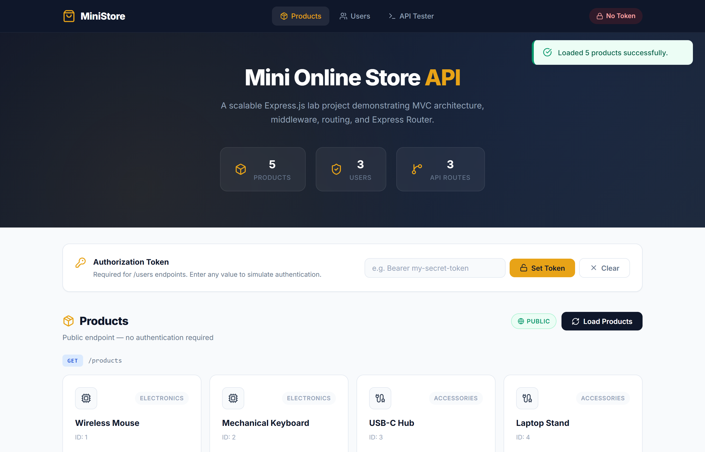
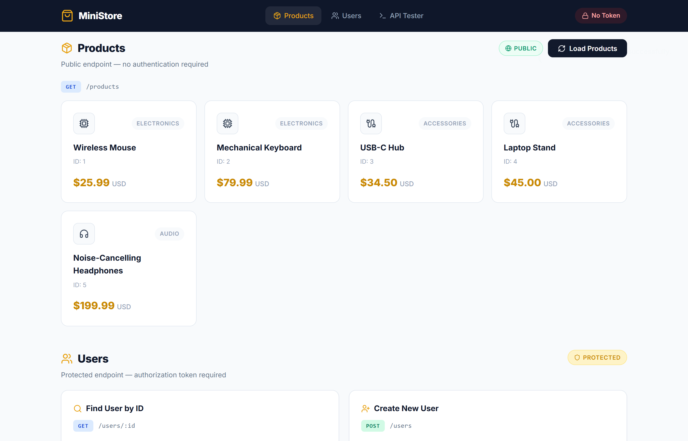
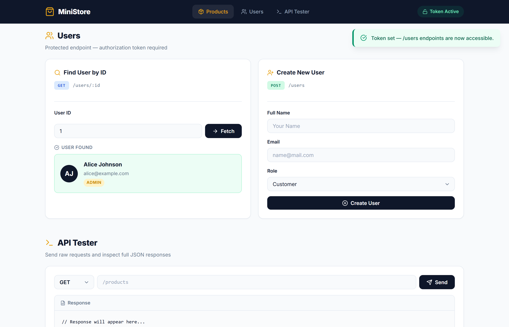
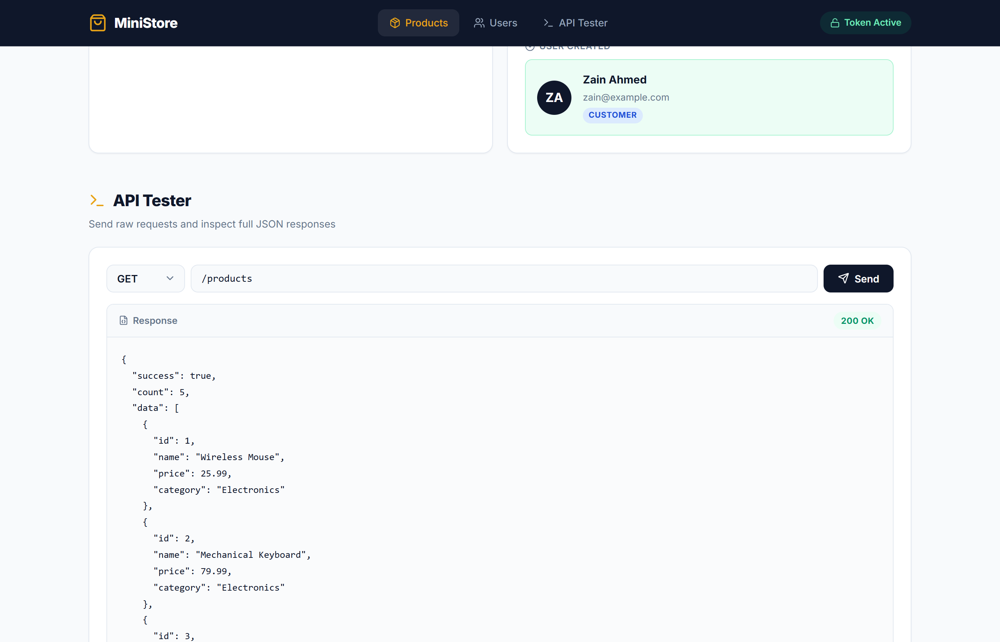
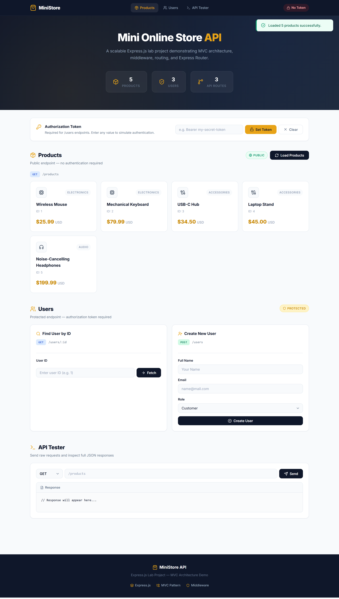

# Mini Online Store API

A complete **Express.js** lab project demonstrating **Scalable Application Architecture (MVC Pattern)** with a branded frontend UI. Built to showcase middleware, modular routing with Express Router, and clean folder structure.



---

## Table of Contents

- [Features](#features)
- [Architecture](#architecture)
- [Folder Structure](#folder-structure)
- [API Endpoints](#api-endpoints)
- [Screenshots](#screenshots)
- [Getting Started](#getting-started)
- [How to Test](#how-to-test)
- [Tech Stack](#tech-stack)

---

## Features

- **MVC Architecture** — Clean separation of Routes, Controllers, and Middleware
- **Express Router** — Modular routing instead of monolithic app.js
- **Global Middleware** — Request logger applied to every incoming request
- **Route-Level Middleware** — Auth middleware protecting only `/users` endpoints
- **RESTful API** — GET and POST endpoints with proper status codes
- **Error Handling** — 404 catch-all for undefined routes
- **Branded Frontend** — Dark slate + gold accent UI with real SVG icons (Lucide)
- **API Tester** — Built-in raw request builder to test any endpoint
- **Responsive Design** — Works on desktop, tablet, and mobile

---

## Architecture

This project follows the **Restaurant Analogy** to explain Express.js concepts:

| Express Concept | Restaurant Analogy |
|---|---|
| **HTTP Request** | Customer walking into the restaurant |
| **Logger Middleware** | Front-door greeter who logs every visitor |
| **Auth Middleware** | Bouncer at the VIP section (checks tokens) |
| **Router** | Menu sections (Products, Users) |
| **Controller** | Kitchen chef who prepares the response |
| **Response** | Finished dish served back to the customer |
| **404 Handler** | Waiter saying "Sorry, that's not on the menu" |

---

## Folder Structure

```
Mini-Online-Store-API/
├── app.js                            # Main entry point & server listener
├── package.json                      # Dependencies & scripts
│
├── controllers/                      # Business logic (MVC — Controller)
│   ├── productController.js          # GET /products handler
│   └── userController.js             # GET /users/:id & POST /users handlers
│
├── middleware/                        # Custom middleware functions
│   ├── logger.js                     # Logs request method & URL (global)
│   └── auth.js                       # Simulates token authentication (route-level)
│
├── routes/                           # Modular routes using express.Router()
│   ├── products.js                   # Product route definitions
│   └── users.js                      # User route definitions
│
├── public/                           # Frontend (static files)
│   ├── index.html                    # Single-page app shell
│   ├── css/
│   │   └── style.css                 # Branded stylesheet
│   └── js/
│       └── app.js                    # Client-side application logic
│
└── screenshots/                      # Project screenshots
```

---

## API Endpoints

| Method | Endpoint | Auth | Description |
|--------|----------|------|-------------|
| `GET` | `/products` | No | Returns all products (dummy data) |
| `GET` | `/users/:id` | Yes | Returns a single user by ID (`req.params`) |
| `POST` | `/users` | Yes | Creates a new user (`req.body`) |
| `GET` | `/` | No | API welcome message with endpoint list |
| `*` | `*` | — | 404 catch-all for undefined routes |

### Middleware Flow

```
Request → [logger] → [express.json()] → Route Match?
                                           │
                     ┌─── /products ───────►│ productController (no auth)
                     │                      │
                     └─── /users ──────────►│ [auth] → userController (token required)
                                           │
                                    No Match → 404 Handler
```

---

## Screenshots

### Hero & Landing Page
The landing page with project stats and navigation.


### Products Section
Public endpoint — fetches and displays all products from `GET /products`.



### Users — Find by ID
Protected endpoint — fetches a user with `GET /users/:id` (requires auth token).



### Users — Create New User
Creates a user via `POST /users` with name, email, and role from `req.body`.


### API Tester
Built-in raw request builder — send any HTTP method to any endpoint and inspect the JSON response.



### Full Page Overview
Complete view of the entire application.



---

## Getting Started

### Prerequisites

- **Node.js** (v14 or higher)
- **npm** (comes with Node.js)

### Installation

```bash
# 1. Clone the repository
git clone https://github.com/ZainDevX/Zain-FA23-BSE-047.git

# 2. Navigate to the project folder
cd Zain-FA23-BSE-047/Mini-Online-Store-API

# 3. Install dependencies
npm install

# 4. Start the server
npm start
```

The server will start on **http://localhost:3000**

### Development Mode (auto-reload)

```bash
npm run dev
```

---

## How to Test

### Using the Frontend

1. Open **http://localhost:3000** in your browser
2. Products load automatically on page open
3. To access `/users` endpoints:
   - Enter any token value (e.g., `Bearer my-secret-token`) in the **Authorization Token** bar
   - Click **Set Token**
4. Try **Find User by ID** (enter 1, 2, or 3)
5. Try **Create New User** with a name and email
6. Use the **API Tester** to send raw requests

### Using cURL

```bash
# Get all products (public)
curl http://localhost:3000/products

# Get user by ID (requires token)
curl -H "Authorization: Bearer test" http://localhost:3000/users/1

# Create a new user (requires token)
curl -X POST \
  -H "Authorization: Bearer test" \
  -H "Content-Type: application/json" \
  -d '{"name": "Dave", "email": "dave@example.com", "role": "customer"}' \
  http://localhost:3000/users

# Test 404 handler
curl http://localhost:3000/nonexistent
```

---

## Tech Stack

| Layer | Technology |
|-------|-----------|
| **Runtime** | Node.js |
| **Framework** | Express.js 4.x |
| **Architecture** | MVC (Model-View-Controller) |
| **Frontend** | Vanilla HTML/CSS/JS |
| **Icons** | Lucide Icons (SVG) |
| **Typography** | Google Fonts (Inter) |
| **Color Scheme** | Dark Slate (#0F172A) + Gold Accent (#E8A317) |

---

## Key Concepts Demonstrated

1. **express.json()** — Built-in middleware for parsing JSON request bodies
2. **app.use()** — Mounting global middleware (logger)
3. **express.Router()** — Creating modular, mountable route handlers
4. **Router-level middleware** — Applying auth only to specific route groups
5. **req.params** — Accessing URL parameters (`:id`)
6. **req.body** — Accessing POST request data
7. **Error handling** — 404 catch-all middleware at the end of the stack
8. **Static file serving** — `express.static()` for the frontend

---

<p align="center">
  <strong>Zain — FA23-BSE-047</strong><br/>
  Advanced Web Technologies — Semester 6
</p>
